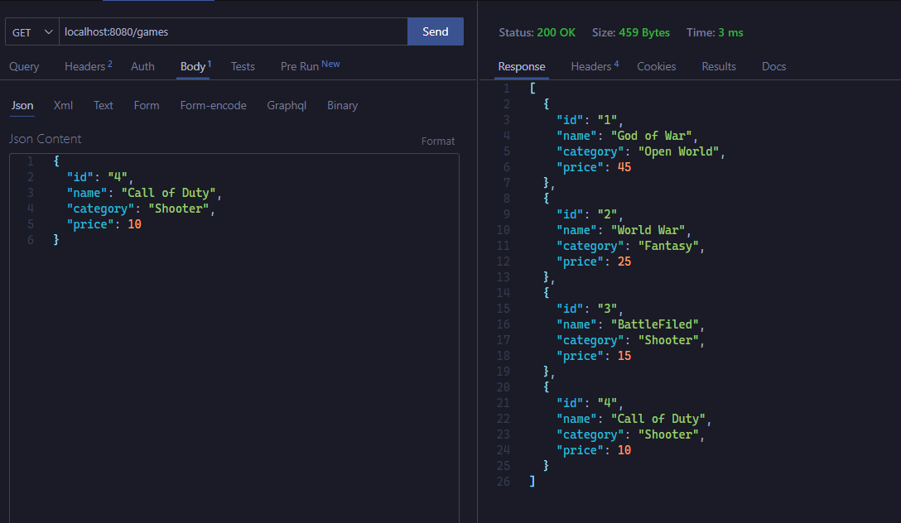
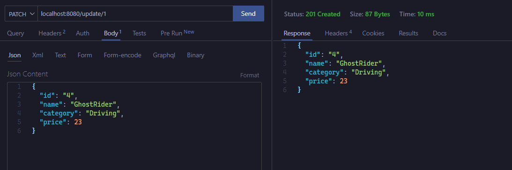

# How to Build Simple JSON - Server API with Go

## Project Structure


## STEP - 1

- First we will create a `main.go` file in the root folder
- Than we will run the `go mod init` basically we write the project name or any nae you want which is basically important
it will create a `go.mod` file which will hold project name as module

```go
go mod init json-server
```

- Because we are using `gin web framework` so we have to add in our project - run this command in terminal

```go
 go get -u github.com/gin-gonic/gin
```

## Step - 2

Create a model for your API
In GO `struct` is simply a class

```go
package model

type Game struct {
	ID       string  `json:"id"`
	NAME     string  `json:"name"`
	CATEGORY string  `json:"category"`
	PRICE    float32 `json:"price"`
}
```

To see things visually we will give it some initial hard coded data to load

```go
var InitialData = []Game{
	{
		ID:       "1",
		NAME:     "God of War",
		CATEGORY: "Open World",
		PRICE:    45.0,
	},
	{
		ID:       "2",
		NAME:     "World War",
		CATEGORY: "Fantasy",
		PRICE:    25.0,
	},
	{
		ID:       "3",
		NAME:     "BattleFiled",
		CATEGORY: "Shooter",
		PRICE:    15.0,
	},
}
```

## Step - 3

Create a folder inside root folder name helper or anything you like in this folder we will create the all the methods for our API

### GET REQUEST

we are working on different folder so we don't basically need main package yet we will create our own package and import it into the main file.
Because of recent updates we can not directly use any other package we have to give reference schema for example

If we wanna get any function or method or anything we will use `model.<name>` just in this case we are using `model.InitialData` to get the hard-coded data

```go
model "json-server/model"
```

```go
package helper

import (
	"net/http"

	model "json-server/model"

	"github.com/gin-gonic/gin"
)
// This will load all the data which is already available
func Get(c *gin.Context) {
	c.IndentedJSON(http.StatusOK, model.InitialData)
}

// getting data specific data based on ID
func GetByID(c *gin.Context) {
	// this getting the reference ID from JSON that we used
	id := c.Param("id")
	// for every data inside the our hard coded data
	for _, data := range model.InitialData {
		// if the ID match with our params ID we will return that specific data
		if data.ID == id {
			c.IndentedJSON(http.StatusOK, data)
			return
		}
	}
	// if not than We are Panic
	c.IndentedJSON(http.StatusNotFound, gin.H{"Panic": "Game Not Found"})
}
```

#### Response in Our Browser

To see response and our data and if it's working correctly

- Go to main.go file. Don't forget to write you functions name with capital word which means GLOBAL we can access it anywhere and w are dealing with external package like we call it `package helper` so we have to give it to the reference to access all the properties or anything

```go
helper "json-server/helper"
```

```go
package main

import (
	helper "json-server/helper"

	"github.com/gin-gonic/gin"
)

func main() {
	// initializing our routers
	var router *gin.Engine = gin.Default()
	// to get everything
	router.GET("/games", helper.Get)
	// to get specific data
	router.GET("/games/:id", helper.GetByID)
	// setting local-host and 8000 as  port
	router.Run("localhost:8080")
}

```

```go
go run main.go
```

 After that our server will start running at ``localhost:8080``
To see that data we have to do this

```http
localhost:8080/games
```

- For Specific QUERY to access based on our ID

```http
localhost:8080/games/1
// OR
localhost:8080/games/2
// OR
localhost:8080/games/3
```

We are testing this inside Vscode so BUT you can use the same URL to see response in browser


### POST REQUEST

```go
package helper

import (
	model "json-server/model"
	"net/http"

	"github.com/gin-gonic/gin"
)

func Post(c *gin.Context) {
	// initializing our model structure to insert new data based on MODEL
	var newGames model.Game
	// BindJSON is use to bind newDATA inside our JSON demo data
	if err := c.BindJSON(&newGames); err != nil {
		// if there is error than Panic Situation
		println("Panic: Error")
		return
	}
	// if no error than we will append or add new data to our Initial dummy data
	model.InitialData = append(model.InitialData, newGames)
	// than we will see the response
	c.IndentedJSON(http.StatusCreated, newGames)
}
```

#### Response


- Data We added to GET and SEE all of them



### DELETE REQUEST

```go
package helper

import (
	"fmt"
	model "json-server/model"
	"net/http"

	"github.com/gin-gonic/gin"
)

func Delete(c *gin.Context) {
	// getting the reference oof the ID
	id := c.Param("id")
	// based on  index we will get every single data
	for i, singleGame := range model.InitialData {
		// if the ID in our json match with the our parameter ID
		if singleGame.ID == id {
			// we will delete the data
			model.InitialData = append(model.InitialData[:i], model.InitialData[i+1:]...)
			// to see the response
			c.IndentedJSON(http.StatusCreated, singleGame)
			// than we will print Means deleted successfully
			fmt.Println("Deleted Successfully")
		}
	}
}
```

#### Response

On Right Side it shows which data we deleted based on the ID


### UPDATE REQUEST

```go
package helper

import (
	model "json-server/model"
	"net/http"

	"github.com/gin-gonic/gin"
)

func Update(c *gin.Context) {
	// we will query the data based on the ID
	id := c.Param("id")
	// and the data model to execute new data
	var updatedGame model.Game
	// based on our dummy data we will loop through each and every data
	for i, singleGame := range model.InitialData {
		// if the ID match with our reference ID
		if singleGame.ID == id {
			// we will update all these parameters
			singleGame.ID = updatedGame.ID
			singleGame.NAME = updatedGame.NAME
			singleGame.CATEGORY = updatedGame.CATEGORY
			singleGame.PRICE = updatedGame.PRICE
			// after that we will bind this new DATA to OLD data
			if err := c.BindJSON(&updatedGame); err != nil {
				// if there is an error we will panic
				println("Panic: Error Inserting NEW DATA")
				return
			}
			// than we will append all the data as JSON
			model.InitialData = append(model.InitialData[:i], updatedGame)
			// it will give us response
			c.IndentedJSON(http.StatusCreated, updatedGame)
		}
	}
}
```

#### Response

Basically we are changing the first dummy data into new data we set ID to 4 and vice versa also other parameters



## Main File after Implementing all the REQUEST

```go
package main

import (
	helper "json-server/helper"

	"github.com/gin-gonic/gin"
)

func main() {
	var router *gin.Engine = gin.Default()
	router.Run("localhost:8080")
	router.GET("/games", helper.Get)
	router.GET("/games/:id", helper.GetByID)
	router.POST("/post", helper.Post)
	router.DELETE("/delete/:id", helper.Delete)
	router.PATCH("/update/:id", helper.Update)
}
```

## Final Thoughts:-

I know that is not perfect way to do everything but It's a simple and straight forward wa to do and Basically if we visit th official website [GO DOCS for RestFUL API Using GIn](https://go.dev/doc/tutorial/web-service-gin) the few of the stuff is outdated because many things has changed after the new Updates I hope this may help to those who are curious to explore different things in LIFE

## Declaimer:-

Few of end-points I have changed

```http
// To get all the DATA

localhost:8080/games

// To get Specific DATA

localhost:8080/games/<ID>

// To post REQUEST
localhost:8080/post

// To Delete based on specific ID

localhost:8080/delete/<ID>

// To PATCH -- UPDATE based on ID

localhost:8080/update/<ID>
```
